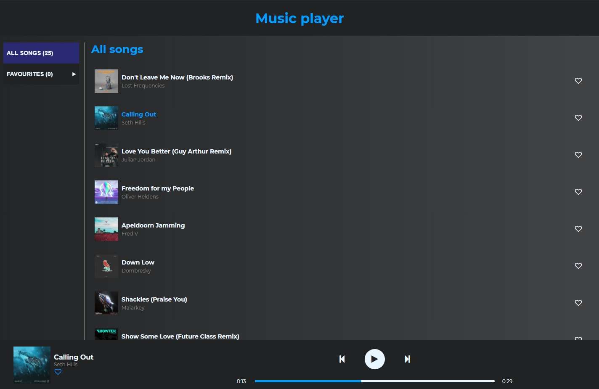
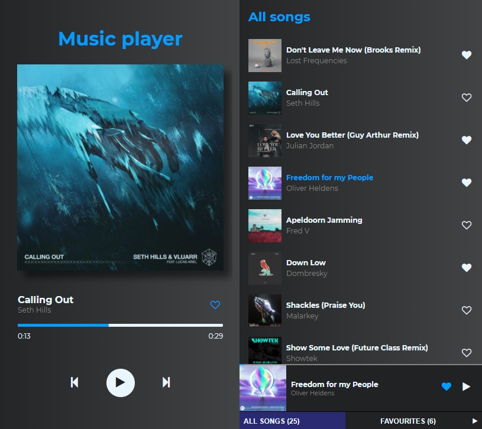

## DESKTOP

## MOBILE

# music-player
!I use free hosting so there may be a slight lag in loading the song, so please understand 🤗

Music player with songs released for free. Now i can listen to music that is not on spotify, you can too, feel free to use it! :D
Player is connected with my [api](https://github.com/jarek-janowski/music-api), so i will update my player everytime i find something cool to add there. You can add song to favourites and listen whatever you like. Go [there](https://jarek-janowski.github.io/music-player/) and try it! 

## TOOLS

- create-react-app
- React.js
- React Hooks
- JS Locale Storage
- sass/scss
- my own simple [api](https://github.com/jarek-janowski/music-api)
- PWA

## Available scripts

`npm start` - runs development mode

`npm run build` - runs build process for production

`npm run deploy` - runs build process and publish the page using `gh-pages` branch
